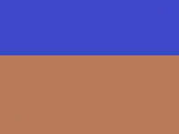
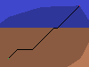
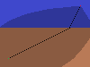
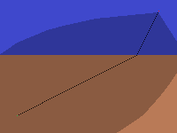
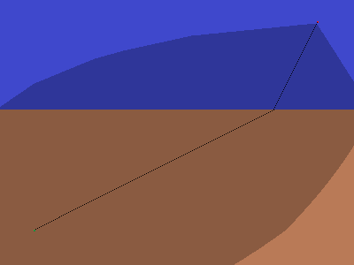
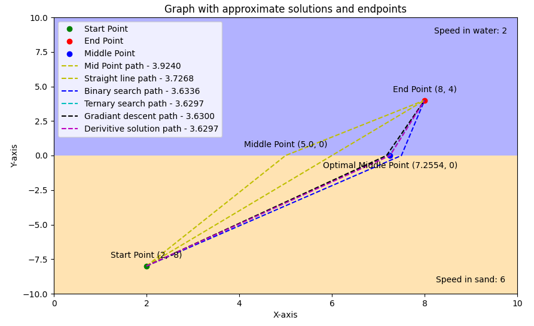
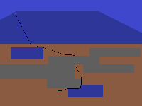
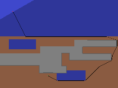

# Pathfinding On Weighted Area Images

## About

This project iterates over all `.png` images in the `input_images/` directory, generating a weighted grid based on a specified `CELL_SIZE`. It identifies start and end points in these images, denoted by green and red squares, respectively. The script applies various pathfinding algorithms, including Breadth-First Search (BFS), Dijkstra's, and A*, to solve for the shortest path across different terrains with varied weights. The output consists of images highlighting the shortest path in black and marking visited nodes in a darker shade. The resolution of the output images is inversely proportional to the `CELL_SIZE`. After processing, the images are displayed to the user through a GUI. The process repeats for each input image, and all output images are saved in the `output_images/` folder.

## Core Problem

The primary challenge addressed by this project is the traversal of terrain with distinct characteristics, like water and sand, where each type of terrain imposes a different traversal cost or weight. This problem is analogous to real-world scenarios where navigational paths need to be optimized based on terrain difficulty. The project provides a mathematical comparison of different algorithmic solutions to this problem in `mathsample.py`, which aids in understanding the effectiveness of various algorithms under different conditions, such as high degrees of freedom (DOF) and resolution.

## Example Results

With a varying `CELL_SIZE`, the output is more refined, and the path accuracy is enhanced. Below are examples of input and output images using the A* algorithm with different DOFs and `CELL_SIZE`.

### Solutions generate with A* using different parameters










### Optimal solution with math



### Example with more terrains and obstacles




## Install Dependencies

To install the necessary dependencies, run the following command:

```shell
pip install -r requirements.txt
```

## Run Script

Execute the main script with the following command:

```shell
python main.py
```

## Check with Math

For a mathematical comparison and analysis, run:

```shell
python mathsample.py
```

## Additional Features

### Resolution Adjustment

- Users can modify the resolution of pathfinding by altering the CELL_SIZE, which adjusts how the image is sampled.

### Multiple Degrees of Freedom

- The project supports various degrees of freedom, ranging from standard Manhatan to an extended set of up to 24 DOFs, allowing for a comprehensive analysis of pathfinding capabilities.

### Interactive GUI

- An intuitive graphical interface displays final results, enhancing user engagement and understanding of the algorithmic processes.

### Automated Processing

- The script automatically processes images from the input folder and outputs the results, streamlining the workflow. Images are recommended to be created in paint (offering inate weight support).

### Comparative Analysis

- Users can compare the effectiveness of different algorithms and settings, providing insights into optimal pathfinding strategies for varying terrains.

### Projects offer algorithm unit tests

- Algorithm functionality is ensured with unit tests.

### Offers easy expandability

- Enables for easy implementation of addidional parametters for specific use cases and parameter tuning. Input is in images which allows for a variaty of inputs which can be tailored by user needs.
