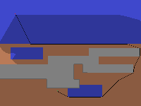

# Pathfinding On Weighted Area Images

## About

Iterates over all .png images in *input_images/* generates weighted grid based on **cell_size** and weight of designated color solves for shortest path between start and end (which are denoted as a singular green and red square in the input image) using multiple different algorithms. Outputed grid generatas a imgaes that has it's shortest path marked with black and visited nodes darkened. Output images size is invertedly proportional to **cell_size**. The generated output images are then displayed to the user, after closing the prompted GUI the next input image is proccessed and the proccess repeats untill all inputs are proccessed. All the output images are also saved in teh *output_images/* folder.

## Example results

In this example the **cell_size** is 0.25 thus making the output bigger and the resulting path more accurate.




## Install dependencies

``` shell
pip install -r requirements.txt
```

## Run script

``` shell
run main.py
```
